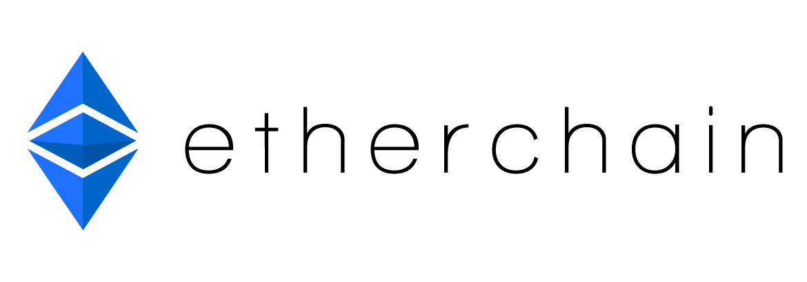

<!--[![Contributors][contributors-shield]][contributors-url]
[![Forks][forks-shield]][forks-url]
[![Stargazers][stars-shield]][stars-url]
[![Issues][issues-shield]][issues-url]
[![MIT License][license-shield]][license-url]
[![LinkedIn][linkedin-shield]][linkedin-url]-->

<!-- PROJECT LOGO -->
 

  

  <h3 align="center">Projeto Integrado Multidisciplinar - 2º Semestre</h3>

  

    Blockchain
     
    <a href="https://github.com/othneildrew/Best-README-Template"><strong>Explorar a Documentação »</strong></a>
     
     
    <!--<a href="https://github.com/othneildrew/Best-README-Template">View Demo</a>
    ·-->
    <a href="https://github.com/othneildrew/Best-README-Template/issues">Reportar Bug</a>
    ·
    <a href="https://github.com/othneildrew/Best-README-Template/issues">Solicitar Função</a>
  

<!-- TABLE OF CONTENTS -->
## Sumário

* [Sobre o Projeto](#about-the-project)
  * [Criado com](#built-with)

<!-- ABOUT THE PROJECT -->
## Sobre o projeto

![Etherchain Screenshot][product-screenshot]

### Criado com

* [C#]()
* [.NET Framework 4.7.2]()
* [SQL Server Developer]()

## Referências
* [Shields.io](https://shields.io)
* [Font Awesome](https://fontawesome.com)

<!-- MARKDOWN LINKS & IMAGES -->
<!-- https://www.markdownguide.org/basic-syntax/#reference-style-links -->
[product-screenshot]: images/frmBase.png
